# Typora-结构类操作

## 1.多级标题

通过 "#+空格+内容 " 注:#的个数代表是第几级标题

**快捷键: Ctrl+1~6** 表示1到6级标题, 	Ctrl+0 是清除标题

```
# 这是第一级标题

## 这是第二级标题

### 这是第三季标题

#### 这是第四级标题

##### 这是第五级标题

###### 这是第六集标题

这是第七级标题 (没有7级标题)
```

## 2.有序列表

**快捷键:Ctrl+Shift+[**

①编号后,如:1.+空格+内容  一定要有空格!

②行末回车,序号会自动添加

​	行末↓键,序号不会添加

③添加/删除某一行内容,需要会自动调整

④降级快捷键:Tab

​	升级快捷键:Shift+Tab

⑤取消自动序号,可以通过两次回车键,或者↓键


1. 打开冰箱
   1.  上一行执行回车+Tab键实现降级,成为二级的有序列表,
2. 把大象放进冰箱
3. 关闭冰箱

## 3.无序列表

**快捷键:Ctrl+Shift+]**

①* 或者 - +空格+内容 一定要有空格!

②有序列表和无序列表可以交错使用

③使用Tab 或者Shift+Tab进行升降级,同时可使用快捷键进行有序与无序列表的转换

例1:

- 青菜
- 水果
  1. 梨
  2. 苹果
  3. 桃子
- 肉

例2:

- 青菜
- 水果
  - 梨
  - 苹果
  - 桃子
- 肉

## 4.任务列表

① -+空格+[+空格+]+空格+内容 每一个符号后都要有空格!

②任务列表没有快捷键

例1:

- [ ] 每天刷一道题            	 "- [ ] 每天刷一道题"
- [ ] 每天回顾前一天的内容

## 5.表格

**快捷键:  Ctrl + T**

①创建方式: |学号|姓名|性别|年龄|+回车

②第一行内容输入完,想输入第二行的内容,按:Ctrl + 回车

③将光标放在表格内,在左上角出现"调整表格"

④将光标放在表格内,点击右键,可以看到更多的功能,其中:右键→表格→扩展功能(插入行/列,移动行/列),或者看表格右上角的三个小点,点击查看更多操作

| 学号 | 姓名 | 性别 | 年龄 |
| :--: | :--: | :--: | :--: |
| 001  | 张三 |  男  |  21  |
| 002  | 李四 |  女  |  22  |
|      |      |      |      |

# Typora-代码类操作

## 1. 行内代码

①创建方式:`行内代码` "反引号+内容+反引号"   反引号:`

②特点,在行内,字体背景加黑,同时字体会稍微小一些

## 2.代码块

**快捷键: *Ctrl + Shift + K***

①创建方式:	```+编程语言	或者	~~~+编程语言	然后 回车

②相关设置:文件→偏好设置→Markdown→勾选[显示行号]→勾选[代码快自动换行]→重启Typora

```
```python (回车以后就出现代码块,退出代码块编辑:Ctrl+回车)
def hello():

​	print("hello world")

hello()
```

```python
def hello():
	print("hello world")
hello()
```

# Typora-元素类操作

## 插入图片

**快捷键: *Ctrl + Shift + I***

①创建方式: !+[]+()	-->	选择图片

②相关设置:文件→偏好设置→图像→选择[复制图片到./$(filename).assets文件夹]→勾选[优先使用相对路径]→重启Typora

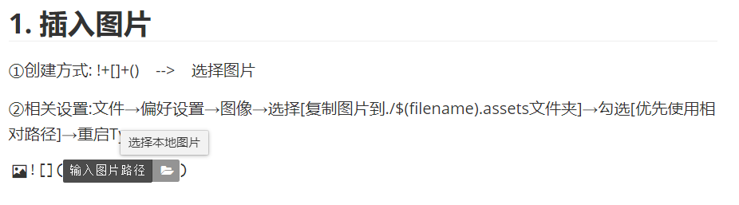

③在同级的目录中会出现一个 :***Typora操作学习文档.assets***的文件夹

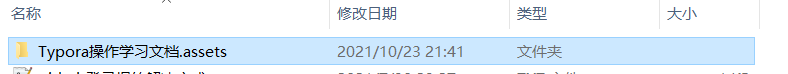

# Typora-文字类操作

# 

## 删除线

 ~~波浪号~~(使用波浪号)


## 斜体

(内容两边各一个星号*) 

*斜体*	

## 加粗

(内容两边各两个星号**) 

**加粗**  

## 斜体 + 加粗

(内容两边各三个星号***)

***斜体+加粗***     

## 下划线

​	下划线是HTML的语法

​	**快捷键:	*Ctrl + U***

```
<u>下划线</u>
```

​	<u>下划线</u>

## 高亮(需勾选扩展语法)

```
这是用 ==高亮== 	两个'=='来显示高亮
```

​		==高亮==

## 下标(需勾选扩展语法)

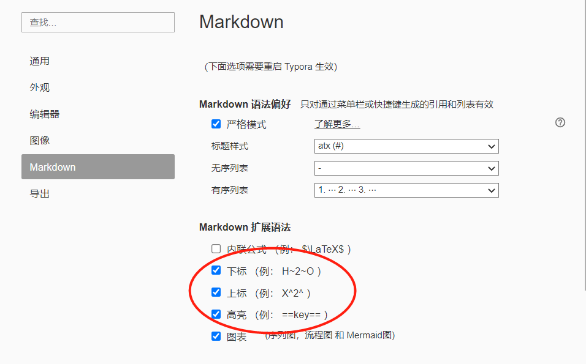

```
水 H~2~O
```

水 H~2~O

## 上标(需勾选扩展语法)

```
面积 m^2^
```

面积: m^2^

## 跳转

1. 外部跳转--超链接,格式为`[link text](link)`,执行跳转: **Ctrl + 鼠标左击**

   ```
   [百度网页](https://www.baidu.com)
   ```

   [百度网页](https://www.baidu.com)

2. 内部跳转-- 本文件内跳(Typora支持)

   格式为`[link text](#要去的目标--标题)`

   ```
   [我想跳转](#2.有序列表) 只能跳转到标题
   ```

   [我想跳转](#2.有序列表)

3. 自动链接

```
使用 <> 包括的URL或者邮箱地址会被自动转换为超链接
<www.baidu.comaidu.com>
```

<www.baidu.com>

## 引导

```
>也可以在引用中
>>使用嵌套的引用
```

> 也可以在引用中
>
> > 使用嵌套的引用

# Typora-画图(需勾选扩展语法)

## 流程图(graph)

概述

```
graph 方向描述
	图表中的其他语句
```

关键字graph表示一个流程图的开始,同时需要指定该图的方向,

其中"方向描述"为:

| 用词 | 含义     |
| ---- | -------- |
| TB   | 从上到下 |
| BT   | 从下到上 |
| RL   | 从右到左 |
| LR   | 从左到右 |

> T = TOP ,B = BOTTOM, L = LEFT, R = RIGHT , D = DOWN

最常用的布局方向是TB,LR

```
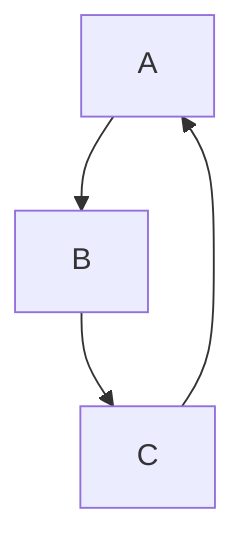


```
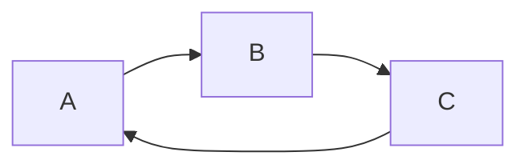


### 	**流程图常用符号及含义**

#### 	**节点形状**

| 表述       | 说明           | 含义                                              |
| ---------- | -------------- | ------------------------------------------------- |
| id[文字]   | 矩形节点       | 表示过程,也就是整个流程中的一个环节               |
| id(文字)   | 圆角矩形节点   | 表示开始和结束                                    |
| id((文字)) | 圆形节点       | 表示链接,为避免流程过长或有交叉,可将流程切开.成对 |
| id{文字}   | 菱形节点       | 表示判断,决策                                     |
| id>文字]   | 右向旗帜状节点 |                                                   |

#### 	**单向箭头线段:**表示流程进行方向

> id即为节点的唯一标识,A~F是当前节点的名字,类似于变量名.画图时便于引用
>
> 括号内是节点中要显示的文字,默认节点的名字和显示都为A

```
graph TB
	A
	B(圆角矩形节点)
	C[矩形节点]
	D((圆形节点))
	E{菱形节点}
	F>右向旗帜状节点]
```

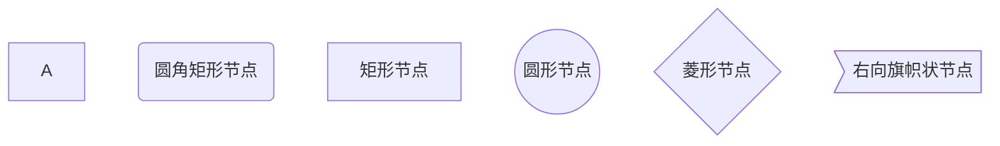

```
graph TB
	begin(出门)-->buy[买炸鸡]
	buy --> IsRemaining{"还有没有炸鸡?"}
	IsRemaining -->|有|happy[买完炸鸡开心]-->goBack(回家)
	IsRemaining--没有-->sad["伤心"]-->goBack
```

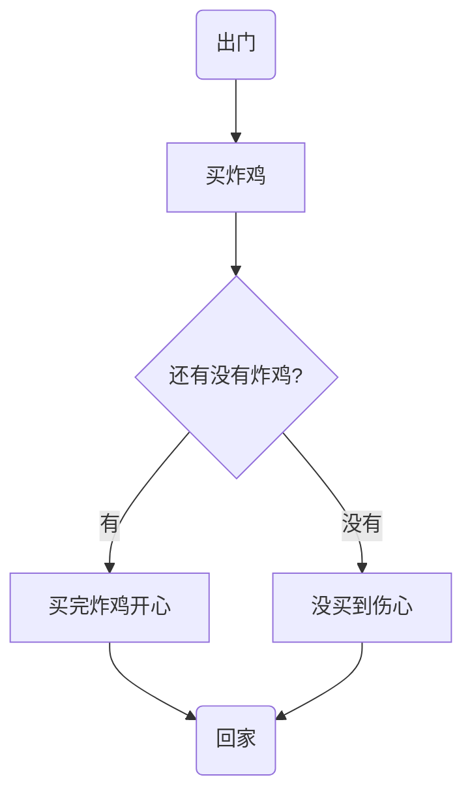

### 	**连线**

```
graph TB
	A1-->B1
	A2---B2
	A3--text---B3
	A4--text-->B4
	A5-.-B5
	A6-.->B6
	A7-.text.-B7
	A8-.text.->B8
	A9===B9
	A10==>B10
	A11==text===B11
	A12==text==>B12
```


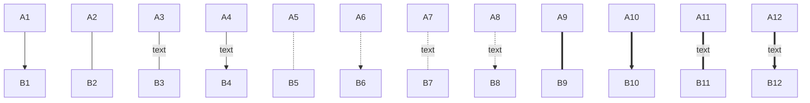

### **子图表**

使用以下语法添加子图表

```
subgraph 子图表名称
	子图表中的描述语句...
end
```

```
graph TB
	subgraph 买炸鸡前
		begin(出门)-->buy[买炸鸡]
	end
	buy --> IsRemaining{"还有没有炸鸡?"}
	IsRemaining -->|有|happy[买完炸鸡开心]-->goBack(回家)
	IsRemaining--没有-->sad["伤心"]-->goBack
```

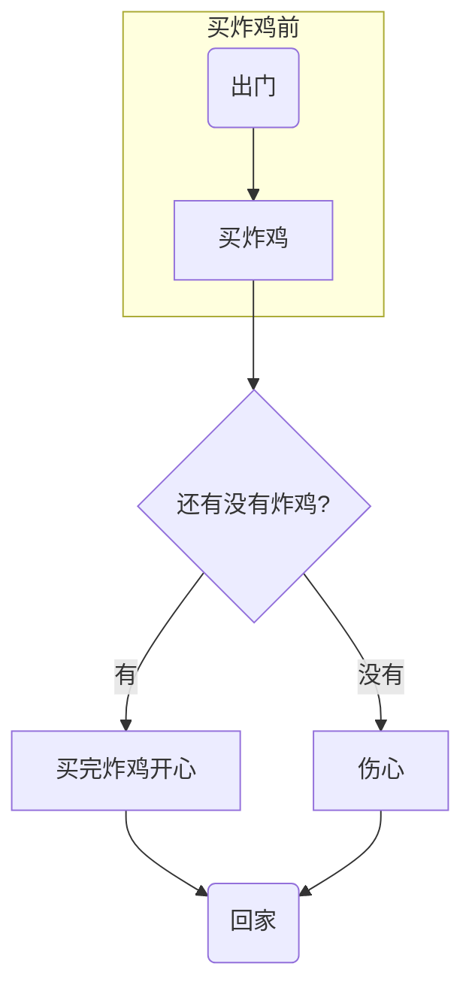

## **序列图**

**概述**

```
sequenceDiagram
	[参与者1][消息线][参与者2]:消息体
	...
```

> `sequenceDiagram`为每幅时序图的固定开头

```
sequenceDiagram
	Title:买炸鸡
	救救->>炸鸡店小哥:还有炸鸡吗?
	炸鸡店小哥-->>救救:没有,要现炸
```

```mermaid
sequenceDiagram
	Title:买炸鸡
	救救->>炸鸡店小哥:还有炸鸡吗?
	炸鸡店小哥-->>救救:没有,要现炸
```

## **饼图(Pie)**

```
pie
	title Pie Chart
	"Dogs" : 362
	"Cats" : 62
	"Rats" : 262
	"Panda": 123
```

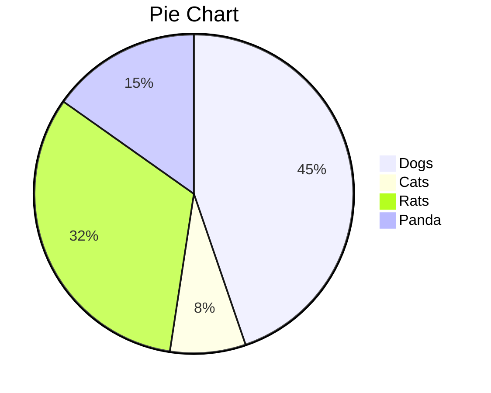


## **甘特图**(gantt)

**概述**

```
gantt
	title 标题
	dateFormat 日期格式
	section 部分名
	任务名:参数一, 参数二, 参数三, 参数四, 参数五
// 参数一:crit(是否重要,红框框) 或者 不填
// 参数二:done(已完成) active(正在进行)
// 参数三:取小名
// 参数四:任务开始时间
// 参数五:任务结束时间
```

```
gantt
	dateFormat YYYY-MM-DD
	title Adding GANTT diagram functionaity to mermaid
	
	section A section
	Completed task		:done,	des1,2021-01-01,2021-01-05
	Active task			:active,des2,2021-01-06,2d
	Futrue task			:crit,active		,des3,after des2, 5d
	Futrue task2		:done		,des4,after des3, 4d
	
	section B section
	Completed task		:done,	des1,2021-01-01,2021-01-05
	Active task			:active,des2,2021-01-06,2d
	Futrue task			:crit,active		,des3,after des2, 5d
	Futrue task2		:done		,des4,after des3, 4d
```

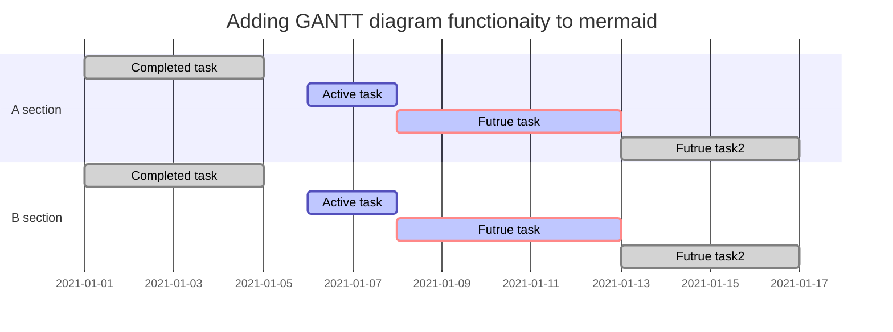


