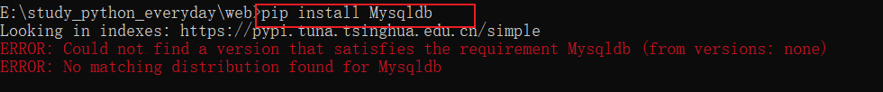

# 学习中遇到的问题汇总

## 1.PyCharm使用技巧：查找 替换

文件内部的字符的查抄替换。列入将json格式文件的中的单引号替换为双引号


首先ctrl+F：


然后ctrl+R:


点击后就能把文件里包含的都替换掉。


另外，这个能让你只选择单词。


## 2.pycharm打不开.log文件?

转载来自:[链接](https://blog.csdn.net/weixin_44780625/article/details/118068491)

pycharm中定义的编码需要设置成utf-8

## 3.Github打不开

github打不开时只需在浏览器中输入一次github的IP地址即可。 

**具体步骤如下：**

1. 通过站长工具找出DNS地址：进入站长工具网站的域名解析网址：http://tool.chinaz.com/dns/ 
2. 在A类型的查询中输入github.com，找出最快的IP地址
3. 显示该地址不安全可以**点击高级选项，添加例外**，之后每次直接访问github网址即可

## 4.flask调试代码更改,模块更改后立即生效

1. app.DEBUG=True时，代码更改后立即生效

```python
app.run(debug=True, host='127.0.0.1', port=8080)
```

2. APP.jinja_env.auto_reload = True时，模板修改后立即生效，无需重启

​	**debug是修改代码,auto_reload是模板修改**

## 5.学习Django做数据迁移时报错


我看到没有Mysqldb,所以安装下,但是报错



所以网上搜索怎么解决?

MySQLdb不支持python3环境,

解决方案: 安装mysqlclient即可


